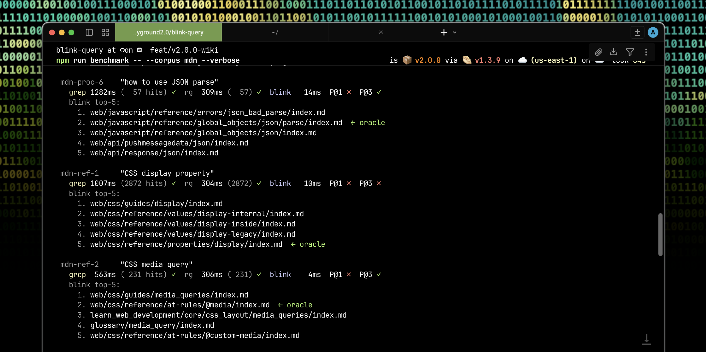

# blink-query

**A typed wiki for LLMs — markdown on disk, resolution in the library.**

[](https://www.npmjs.com/package/blink-query)
[](LICENSE)
[](#development)


blink-query is a knowledge resolution library for LLM agents. Markdown files stay on disk where you can read and edit them; the library adds typed records, title-weighted BM25 search, deterministic path resolution, and an MCP server — all in a SQLite file next to your notes. No cloud, no embeddings, no daemon.


## Features

- **5 typed record types** — `SUMMARY`, `META`, `SOURCE`, `ALIAS`, `COLLECTION` — each carries a consumption instruction for the agent (read the summary / parse JSON / fetch the source / follow the redirect / browse children)
- **Namespaces** — slash-delimited paths group records by topic (e.g., `wiki/concepts`, `decisions/auth`, `people/arpit`); each record has a stable path at `namespace/slug-of-title`
- **Title-weighted BM25 over FTS5** — title matches ranked 10× over body summary, with per-type rank offsets that promote canonical pages
- **Hub-vs-leaf default classifier** — automatically promotes `index` / `README` / `Home` files in hub directories to `SUMMARY`, no per-corpus tuning
- **Path resolution** — deterministic O(1) lookup by namespace/slug, with `NXDOMAIN` / `STALE` / `ALIAS_LOOP` statuses
- **MCP server with 11 tools** — drop-in for Claude Desktop, Claude Code, Cursor, Codex
- **Query DSL** — Peggy-parsed: `wiki where type = "SUMMARY" and tags contains "auth" limit 10`
- **Multi-source ingestion** — markdown directories, PostgreSQL rows, GitHub Issues, git repos, web URLs
- **Zones** — top-level namespaces with default TTL and required-tag policies
- **[[wikilink]] extraction** — auto-creates `ALIAS` records on ingest

---

## Quick start

```bash
npm install -g blink-query
blink init                 # auto-detect agent (Claude Desktop, Code, Cursor, Codex) and write MCP config
blink wiki init my-wiki    # scaffold + ingest a wiki directory
blink doctor               # verify install
```

Or use it as a library:

```bash
npm install blink-query
```

```typescript
import { Blink } from 'blink-query';

const blink = new Blink({ dbPath: './wiki.db' });
await blink.ingestDirectory('./my-wiki');
const results = blink.search('how to configure auth');
```

Step-by-step walkthroughs:

- **[Using blink-query in your project](docs/USING_IN_PROJECT.md)** — install, ingest, query, common patterns, custom derivers, troubleshooting
- **[Connecting to your agent](docs/CONNECTING_TO_AGENT.md)** — Claude Desktop / Code / Cursor / Codex per-agent setup, verification, troubleshooting

---

## Benchmark

One command. Three public markdown corpora. One library configuration.

```bash
npm run benchmark
```

| Corpus | Files | grep mean | ripgrep mean | **blink mean** | vs grep | vs ripgrep |
|---|---|---|---|---|---|---|
| Quartz docs | 76 | 8.9 ms | 11.1 ms | **0.36 ms** | 25× | 31× |
| Obsidian Help | 171 | 15.9 ms | 11.9 ms | **0.56 ms** | 28× | 21× |
| MDN content | 14,251 | 891 ms | 249 ms | **9.83 ms** | **91×** | **25×** |

**blink-query is 25x–91x faster than grep across 3 corpora, 21x–31x faster than ripgrep.** Speed gap widens with corpus size — blink scales sub-linearly, grep scales linearly.

On the 14k-file MDN corpus, **grep returns an average of 1,212 unranked files per query** (because common terms like "Promise" appear in 1,314 files, "DOM" in 9,363). blink returns top-5 ranked. The agent reads ~242x fewer files to find the answer.

Accuracy across the 3 corpora: **P@3 = 79% average (88% on Obsidian, 79% on Quartz, 72% on MDN)**. Verifiable regex oracles for every query in [`benchmark/bench.ts`](benchmark/bench.ts). Methodology, caveats, and reference numbers in [`benchmark/README.md`](benchmark/README.md).



The bench script auto-clones the corpora into `benchmark/corpora/` (gitignored, ~270 MB on first run), runs blink + grep + ripgrep on the same file set with the same query set, and prints a unified comparison. No `--mode` flag. No per-corpus tuning. No presets.

---

## What this is, and isn't

blink-query is a library, not a framework. It's additive on top of plain markdown:

- **Your files stay where they are.** Markdown in `sources/`, `entity/`, `topics/`, `log/<date>/`. You can grep them, open them in any editor, commit them to git, nothing about them is opaque.
- **The library adds an index, types, and a query interface.** Think of blink-query as a deterministic faster path on top of the same files.
- **No embeddings.** BM25 / FTS5 only. If you want semantic retrieval, run a vector store alongside and pick whichever answer is better for the query.
- **No cloud.** SQLite file on disk. MCP server over stdio. Runs entirely on your machine.
- **No magic.** Ingestion is rule-based derivers you can override. Classification is based on filename + frontmatter you control. The query DSL is a Peggy grammar you can read.

If you want raw markdown + grep, the files still work that way. If you want typed records with an index, install the library.

---

## Five record types

The type is a *consumption instruction* — it tells the agent how to use the record, not what it's about. Content carries the domain semantics.

**SUMMARY** — read the summary directly, you have what you need.
Use for processed wiki pages, entity descriptions, topic overviews. The agent doesn't need to fetch anything else.

**META** — structured data (JSON content field).
Use for configuration, log entries, session state, entity attributes. The agent parses `content` as JSON.

**SOURCE** — summary here, fetch the source if you need depth.
Use for references to external documents: papers, URLs, git files, API specs. Summary gives enough to decide whether to fetch.

**ALIAS** — follow the redirect to the target record.
Use for cross-linking. `[[wikilinks]]` in your markdown auto-extract to ALIAS records on ingest.

**COLLECTION** — browse children, pick what's relevant.
Use for namespace indexes. Auto-generated when you resolve a namespace path that has no direct record.

---

## Install in your agent

The easy path:

```bash
npx blink-query init
```

This auto-detects Claude Desktop, Claude Code, Cursor, and Codex. It handles the nvm + absolute-node-path gotcha on macOS/Linux, wraps `npx` in `cmd /c` on Windows, and merges into your existing MCP config — it never overwrites other servers (if the JSON fails to parse it backs up to `.bak` and warns).

Run `blink doctor` afterwards to verify.

### Manual config

**Claude Desktop** — `~/Library/Application Support/Claude/claude_desktop_config.json` (macOS) or `%APPDATA%\Claude\claude_desktop_config.json` (Windows):

```json
{
  "mcpServers": {
    "blink": {
      "command": "npx",
      "args": ["-y", "blink-query", "mcp"],
      "env": { "BLINK_DB_PATH": "~/.blink/blink.db" }
    }
  }
}
```

**Claude Code**:

```bash
claude mcp add-json blink --scope user '{"type":"stdio","command":"npx","args":["-y","blink-query","mcp"]}'
```

**Cursor** — `~/.cursor/mcp.json` (same shape as Claude Desktop, key `mcpServers`).

**Codex** — `~/.codex/config.toml`:

```toml
[mcp_servers.blink]
command = "npx"
args = ["-y", "blink-query", "mcp"]

[mcp_servers.blink.env]
BLINK_DB_PATH = "~/.blink/blink.db"
```

**nvm users**: if your agent can't find `npx`, run `blink init --absolute-node` to write the absolute path to your node binary instead. Avoids the "agent doesn't source shell rc" issue.

### Runtime capabilities

Once connected, the agent can resolve, search, **save new records**, move or delete existing ones, **create new zones** with required-tag policies, and **ingest fresh markdown** — all via MCP tool calls at runtime. No restart, no re-deploy, no re-ingest. The knowledge base grows under the agent's own hands.

The MCP server exposes 11 tools, grouped by what they do:

**Read**

| Tool | Does |
|---|---|
| `blink_resolve` | Deterministic O(1) path lookup with `NXDOMAIN` / `STALE` / `ALIAS_LOOP` statuses |
| `blink_get` | Get a single record by exact path (no resolution) |
| `blink_search` | Title-weighted BM25 search, returns top-K ranked records |
| `blink_query` | Peggy DSL query: structured filters, sort, limit, offset |
| `blink_list` | Browse a namespace, sort by recent / hits / title |

**Write**

| Tool | Does |
|---|---|
| `blink_save` | **Create or update a record** — the agent authors new knowledge at runtime |
| `blink_move` | Move a record from one path to another |
| `blink_delete` | Delete a record by path |
| `blink_ingest` | Ingest a directory of markdown files into typed records |

**Zones**

| Tool | Does |
|---|---|
| `blink_zones` | List all registered zones with their metadata |
| `blink_create_zone` | **Create a new zone** with description, default TTL, and required tags — the agent carves out namespaces on demand |

Drop [`BLINK_WIKI.md`](BLINK_WIKI.md) into your project root (or paste it into your agent's system prompt) so the agent knows how to use the wiki pattern.

---

## CLI

```bash
# Wiki workflows
blink wiki init my-wiki          # scaffold + ingest
blink wiki ingest ./my-wiki      # re-ingest after changes
blink wiki lint                  # find STALE, NXDOMAIN, broken aliases

# Core operations
blink resolve wiki/mcp-protocol  # deterministic O(1) lookup
blink search "tool call protocol"
blink query 'wiki where type = "SUMMARY" limit 10'
blink list wiki --limit 20

# Agent setup
blink init                       # write MCP config for detected agent
blink doctor                     # post-install diagnostic

# Data management
blink ingest ./docs --prefix wiki
blink move wiki/old wiki/new
blink delete wiki/outdated
blink zones
```

All commands support `--json` for machine-readable output and `--db` for a custom database path.

---

## Library API

```typescript
import { Blink, extractiveSummarize } from 'blink-query';

const blink = new Blink({ dbPath: './wiki.db' });

// Ingest a directory of markdown files
await blink.ingestDirectory('./my-wiki', {
  summarize: extractiveSummarize(500),
  namespacePrefix: 'wiki',
});

// Resolve — deterministic O(1) path lookup
const response = blink.resolve('wiki/mcp-protocol');
if (response.status === 'OK') console.log(response.record.summary);

// Search — title-weighted BM25 over typed records
const results = blink.search('tool call protocol');

// Query DSL
const summaries = blink.query(
  'wiki where type = "SUMMARY" order by hit_count desc limit 10',
);

// Save a new record (idempotent on path — upserts by namespace + slug-of-title)
blink.save({
  namespace: 'wiki/concepts',
  title: 'OAuth Flow',
  type: 'SUMMARY',
  summary: 'OAuth 2.1 flow for first-party apps — PKCE, refresh tokens, session scoping.',
  tags: ['auth'],
});

// Create a zone with a required-tag policy
blink.createZone({
  namespace: 'decisions',
  description: 'Architecture decision records',
  defaultTtl: 31536000,    // 1 year, inherited by saves into this zone
  requiredTags: ['adr'],   // save() throws if missing
});

blink.close();
```

All CRUD operations are synchronous (`resolve`, `get`, `save`, `delete`, `move`, `search`, `list`, `query`, `createZone`, `zones`). Only ingestion is async.

---

## Schema doc for your agent

[`BLINK_WIKI.md`](BLINK_WIKI.md) is the document your LLM agent reads to understand how to use blink-query as a wiki. It covers namespace conventions, all five record types with examples, ingest/query/log/lint workflows, and four worked example sessions.

Drop it in your project root or paste it into your agent's system prompt.

---

## Example

[`examples/llm-wiki/`](examples/llm-wiki/) is a complete end-to-end example: a 30-file MCP ecosystem corpus ingested, queried, and benchmarked against grep.

---

## Scope

blink-query handles:

- Markdown and plain text (primary)
- PostgreSQL tables (via `loadFromPostgres`)
- Web URLs (via `loadFromURL`)
- Git repositories (via `loadFromGit`)
- GitHub Issues (via `loadFromGitHubIssues`)

It does *not* do:

- **Vector embeddings** — BM25/FTS5 only. Layer a RAG system on top if you need semantic similarity.
- **Sync or replication** — single SQLite file, local. Sync the markdown source via git and re-ingest.
- **Hosted storage** — no cloud, no accounts. Your data lives in a `.db` file you own.
- **Agent orchestration** — blink-query resolves knowledge. It doesn't plan tasks or coordinate agents.

---

## Development

```bash
npm install
npm run build       # builds parser + library + CLI
npm test            # 524 tests
npm run benchmark   # universal benchmark on 3 public corpora
```

---

## Status

**v2.0.0** — published on npm as `blink-query`. MIT license.

```bash
npm install blink-query        # library
npm install -g blink-query     # CLI + blink init
```

Issues and PRs welcome.
